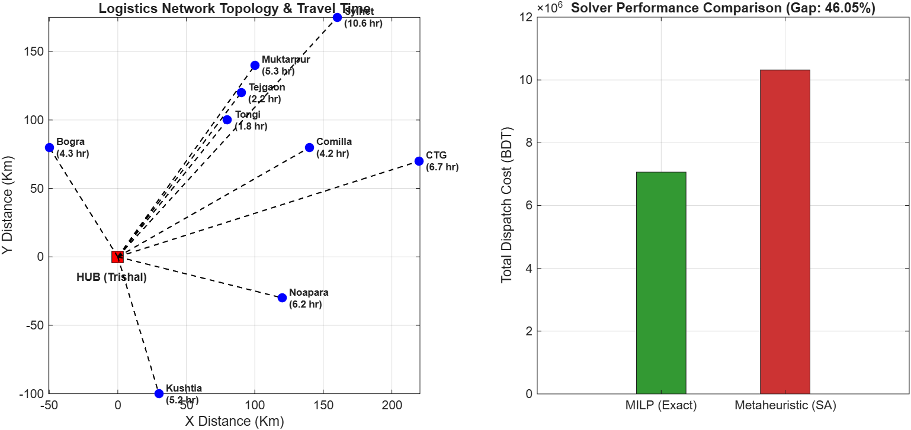

# Multi-Echelon Heterogeneous Fleet Allocation & Route Optimization

An Operations Research framework implemented in MATLAB to solve the Heterogeneous Fleet Allocation and Dispatch Cost Optimization Problem for multi-depot logistics networks.

## Problem Formulation

The problem is modeled as a **Mixed-Integer Linear Programming (MILP)** optimization task. The objective is to minimize the total daily dispatch cost while satisfying depot-specific demand constraints and domain restrictions.

### Mathematical Model

$$\min_{x_{i,v} \in \mathbb{Z}^+} \sum_{i=1}^{N} \sum_{v=1}^{V} R_{i,v} \cdot x_{i,v}$$

$$\text{Subject to: } \sum_{v=1}^{V} C_v \cdot x_{i,v} \ge D_i \quad \forall i \in \{1, \dots, N\}$$

$$x_{\text{Sylhet}, v} = 0 \quad \forall v \in \{1.5\text{T}, 2.5\text{T}, 3.0\text{T}\}$$

Where:
- $N$: Number of regional depots ($N = 9$)
- $V$: Set of vehicle capacity types ($V = \{1.5\text{T}, 2.5\text{T}, 3.0\text{T}, 5.0\text{T}, 7.0\text{T}\}$)
- $R_{i,v}$: Fixed trip rate for vehicle type $v$ to depot $i$
- $C_v$: Carrying capacity of vehicle type $v$ (in Tons)
- $D_i$: Daily demand at depot $i$ (in Tons)
- $x_{i,v}$: Decision variable representing the number of allocated vehicles

---

## Experimental Benchmarking

The exact solver (`intlinprog`) was benchmarked against a custom **Simulated Annealing (SA)** metaheuristic solver over $3,000$ iterations.

### Performance Comparison

| Method | Total Cost (BDT) | Execution Time | Optimality Gap | Optimality Status |
| :--- | :--- | :--- | :--- | :--- |
| **MILP (`intlinprog`)** | **BDT 7,064,537.00** | **0.4846 s** | **0.00%** | **Global Optimum** |
| **Simulated Annealing (SA)** | BDT 10,460,844.00 | 0.3602 s | 48.08% | Local Optimum |

Key Finding: While metaheuristics are computationally fast for NP-hard problems, exact MILP solvers outperform metaheuristics in small-to-medium multi-depot fleet allocation problems by guaranteeing a global optimum without premature convergence.

---

## Visual Outputs

### Logistics Network Topology & Algorithmic Comparison


---

## How to Run

1. Clone this repository:
   ```bash
   git clone [https://github.com/Sifat-Ajmeer-Haque/Heterogeneous-Fleet-Optimization.git](https://github.com/Sifat-Ajmeer-Haque/Heterogeneous-Fleet-Optimization.git)